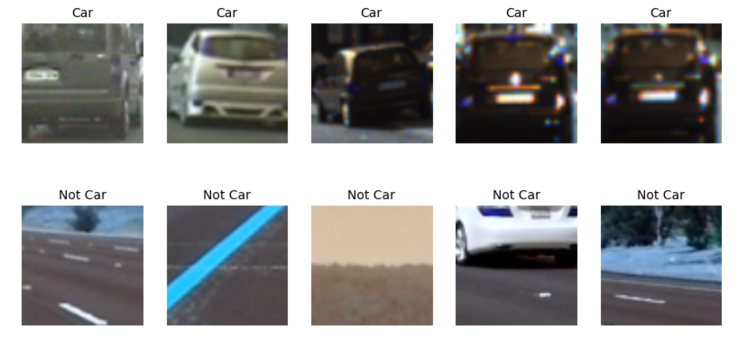
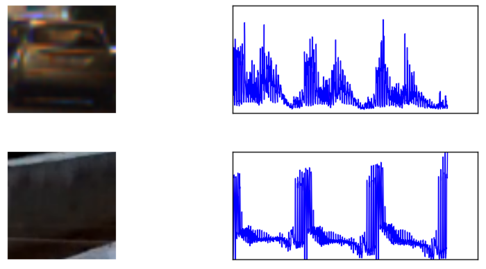
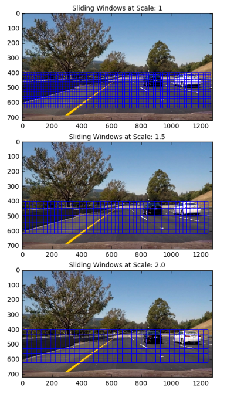
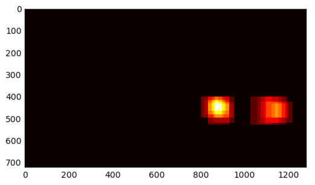
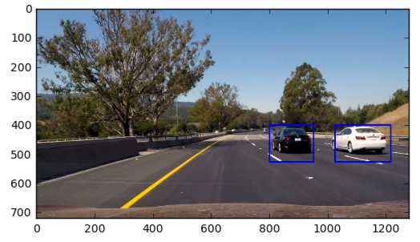

# Vehicle Detection and Tracking

In this project, the goal is to write a software pipeline to detect vehicles in a video.  

## Results

The following videos show the final results of the vehicle detection and tracking on two different tracks:

Project Track                 |Challenge Track                                   
:----------------------------:|:-----------------------------:
 |  

The steps of this project are the following:

* Perform a Histogram of Oriented Gradients (HOG) feature extraction on a labeled training set of images and train a classifier Linear SVM classifier
* Apply a color transform and append binned color features, as well as histograms of color, to your HOG feature vector. 
* Normalize features and randomize a selection for training and testing.
* Implement a sliding-window technique and use trained classifier to search for vehicles in images.
* Run pipeline on a video stream and create a heat map of recurring detections frame by frame to reject outliers and follow detected vehicles.
* Estimate a bounding box for vehicles detected.

## Data

Here are links to the labeled data for [vehicle](https://s3.amazonaws.com/udacity-sdc/Vehicle_Tracking/vehicles.zip) and [non-vehicle](https://s3.amazonaws.com/udacity-sdc/Vehicle_Tracking/non-vehicles.zip) examples to train the classifier.  These example images come from a combination of the [GTI vehicle image database](http://www.gti.ssr.upm.es/data/Vehicle_database.html), the [KITTI vision benchmark suite](http://www.cvlibs.net/datasets/kitti/), and examples extracted from the project video itself. You are welcome and encouraged to take advantage of the recently released [Udacity labeled dataset](https://github.com/udacity/self-driving-car/tree/master/annotations) to augment your training data.  

## Notebooks

Project is implemented in two jupyter notebooks:

- [Train SVM Classifier](Train SVM Classifier.ipynb) - Here cars data is processed and used to train a SVM classifier.
- [Vehicle Detection and Tracking](Vehicle Detection and Tracking.ipynb) - Classifier trained above is used in sliding window fashion on image pyramids to detect and track cars in the given video.

## Report

Here I will consider the rubric points individually and describe how I addressed each point in my implementation. 

### Histogram of Oriented Gradients (HOG)

The code for this step is contained in the 6th cell of the [Train SVM Classifier](notebooks/Train SVM Classifier.ipynb) notebook. `get_hog_features()` is implemented in [feature_extractor.py](feature_extractor.py) (lines 20 through 37)

I started by reading in all the `vehicle` and `non-vehicle` images.  Here are examples of one of each of the `vehicle` and `non-vehicle` classes:

I then experimented with different color spaces and different `skimage.hog()` parameters (`orientations`, `pixels_per_cell`, and `cells_per_block`). I chose random images from each of the two classes and displayed them to get a feel for what the `skimage.hog()` output looks like.

Here is an example using the `YCrCb` color space and HOG parameters of `orientations=9`, `pixels_per_cell=(8, 8)` and `cells_per_block=(2, 2)`. `color_hist()` is implemented in [feature_extractor.py](feature_extractor.py) (lines 47 through 55)

Here is an example showing image colors binned as features. `bin_spatial()` is implemented in [feature_extractor.py](feature_extractor.py) (lines 40 through 44)

I tried various combinations of parameters and kept on iterating until my classifier achieved desired accuracy of **99.24%**. Following are the final configurations that I settled down to.

<pre>
# Configurations
color_space = 'YCrCb'  # Can be RGB, HSV, LUV, HLS, YUV, YCrCb
orient = 9  # HOG orientations
pix_per_cell = 8  # HOG pixels per cell
cell_per_block = 2  # HOG cells per block
hog_channel = 'ALL'  # Can be 0, 1, 2, or "ALL"
spatial_size = (32, 32)  # Spatial binning dimensions
hist_bins = 32  # Number of histogram bins
spatial_feat = True  # Spatial features on or off
hist_feat = True  # Histogram features on or off
hog_feat = True  # HOG features on or off
</pre>

Features thus extracted are very large in number. `Cars` and `Not-Cars` features are combined into a giant matrix and then standarized using `sklearn.StandardScaler()` so that features are scaled to zero mean and unit variance before training the classifier.

Then I randomized the dataset and partitioned it into training and testing set using `sklearn.train_test_split()`.

Finally, I trained a linear SVM using above configurations. SVM training took 20 seconds and achieved a Test Accuracy of 99.24%. Model is then saved to the disk for later use. 

###Sliding Window Search on Image Pyramid

This is the second part of the system, where the classifier trained above is used in sliding window fashion on pyramid of images to detect cars. First, each frame is cropped vertically such that ROI is from the dashboard camera to the horizon. By restricting the ROI to the road, we avoid false detections in the sky and trees. This also cuts the scanning time in half. Then classifier is moved over the cropped image in sliding window fashion with overlap of 2px. This process is repeated three times by scaling ROI by 1.0, 1.5 and 2.0. Such scaling technique is also know as Image Pyramid Technique. The code for this step is contained in [car_finder.py](car_finder.py) in functions `predict_bboxes()`.

Following image shows positive predictions as returned by the our trained SVM classifier on the sliding window image patch.

For each positive prediction, 1 is added onto a heatmap in the area of the bounding box. Then while processing a video the heatmap is averaged over 10 frames to get a smooth bounding box. To remove false detections the heatmap is thresholded. ([car_finder.py](car_finder.py) in functions `find_cars()` and `apply_threshold()`).

I used `scipy.label()` function to draw contours around the positive detection in the heatmap image. ([car_finder.py](car_finder.py) in function `predict_contours()` line 158).

### Video Implementation

To summarize our process: I used a well trained SVM car classifier in sliding window fashion on image pyramid of each frame. The positions of positive detections are recorded. For each positive detection a heatmap is generated by adding 1 for each bounding box pixel. Then the heatmap is thresholded and contour is drawn around the hot blob. Such contours are the location of the detected cars.  

Here's an example result showing bounding boxes overlaid on a frame of video:

Project Track                 |Challenge Track                                   
:----------------------------:|:-----------------------------:
 |  

### Discussion

This was a bit tricky project. It involved a lot of trial and error in finding the right thresholds to make the pipeline work. There are so many hyper-parameters to tune that I think this approach is not very robust. Although, this mechanical approach finally worked out for two videos, I have a suspicion that it may not work for real wild world. I think Neural Network based approach is fitting for this problem. In my next version, I'll try to find a Neural Network based solution.
 
