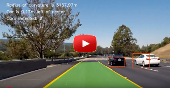
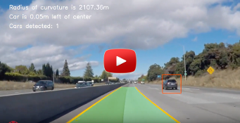

# Vehicle Detection and Tracking

In this project, the goal is to write a software pipeline to detect vehicles in a video.  

## Results

The following videos show the final results of the lanes being detected on two different tracks with varying difficulty:

Project Track                 |Challenge Track                                   
:----------------------------:|:-----------------------------:
 |  

The steps of this project are the following:

* Perform a Histogram of Oriented Gradients (HOG) feature extraction on a labeled training set of images and train a classifier Linear SVM classifier
* Apply a color transform and append binned color features, as well as histograms of color, to your HOG feature vector. 
* Normalize features and randomize a selection for training and testing.
* Implement a sliding-window technique and use trained classifier to search for vehicles in images.
* Run pipeline on a video stream and create a heat map of recurring detections frame by frame to reject outliers and follow detected vehicles.
* Estimate a bounding box for vehicles detected.

Here are links to the labeled data for [vehicle](https://s3.amazonaws.com/udacity-sdc/Vehicle_Tracking/vehicles.zip) and [non-vehicle](https://s3.amazonaws.com/udacity-sdc/Vehicle_Tracking/non-vehicles.zip) examples to train the classifier.  These example images come from a combination of the [GTI vehicle image database](http://www.gti.ssr.upm.es/data/Vehicle_database.html), the [KITTI vision benchmark suite](http://www.cvlibs.net/datasets/kitti/), and examples extracted from the project video itself. You are welcome and encouraged to take advantage of the recently released [Udacity labeled dataset](https://github.com/udacity/self-driving-car/tree/master/annotations) to augment your training data.  

## Notebooks

Project is implemented in two jupyter notebooks:

- [Train SVM Classifier](notebooks/Train SVM Classifier.ipynb) - Here cars data is processed and used to train a SVM classifier.
- [Vehicle Detection and Tracking](notebooks/Vehicle Detection and Tracking) - Classifier trained above is used in sliding window fashion to detect and track cars in the given scene.

## Report

Here I will consider the rubric points individually and describe how I addressed each point in my implementation. 

### Histogram of Oriented Gradients (HOG)

